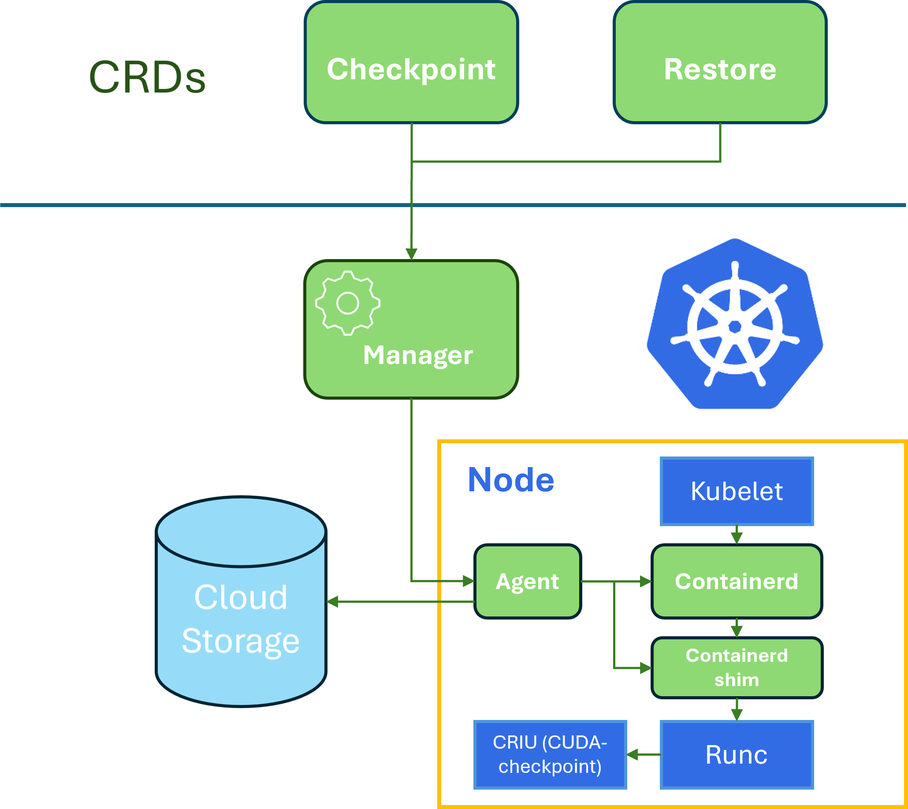

# GRIT: GPU workload checkpointing and restoration

GRIT is a prototype designed to automate the GPU workload migration in a Kubernetes cluster. It enables users to checkpoint the states of a GPU workload and restore them at a later time in a different node with no impact on the final result of the workload.

Its key features include:

- **Least-intrusive to Kubernetes core components** - Currently, only [containerd](https://github.com/containerd/containerd) is slightly changed to support the new workflow for Pod start.
- **No application code changes** - Applications can be checkpointed and restored without altering their source codes.
- **Pod based migration** – GRIT supports the migration of all containers in a Pod.
- **Efficient checkpoint distribution** – Checkpoints are distributed using custom Persistent Volumes (PVs), offering flexibility and efficiency compared to OCI-based image checkpoints.
- **NVIDIA GPU workload support** – GRIT leverages [CRIU](https://github.com/checkpoint-restore/criu) and [cuda-checkpoint](https://github.com/NVIDIA/cuda-checkpoint) to enable checkpointing and restoration of NVIDIA GPU states.

# Architecture

<div align="left">
  
</div>

The above diagram shows the architecture of GRIT. The main components are:
- **GRIT-Manager**: The control-plane component that orchestrates all checkpointing and restoration workflows. It includes controllers and admission webhooks required for lifecycle management.
- **GRIT-Agent**: It runs as a Job Pod created by the GRIT-manager. It is responsible for upload/download checkpoint data and communication with GRIT-runtime.
- **Containerd(shim)**: A modified `containerd` ([diff](contrib/containerd/grit-interceptor.diff)) and a new [containerd-shim](cmd/containerd-shim-grit-v1/), receiving control plane signal from GRIT-Agent, ultimately calling CRIU tools to checkpoint and restore the container process. 

Note: GRIT only works for NVidia GPUs for now. We will add support for AMD GPUs in the future. In addition, GRIT will not preserve Pod IP during migration hence the workload needs to tolerate IP change. Job type computation intensive workloads are good candidates for migration. 

# Quick start

After installing GRIT CRDs and controller, you can use the following commands to checkpoint and restore your workloads.

First, create a pv to store the checkpoint data. In this example, Azure file cloud storage is used:

```bash
$ cat examples/checkpoint-pvc.yaml
apiVersion: v1
kind: PersistentVolumeClaim
metadata:
  name: ckpt-store
  namespace: default
spec:
  accessModes:
    - ReadWriteMany
  storageClassName: azurefile-csi-premium
  resources:
    requests:
      storage: 256Gi

$ kubectl apply -f examples/checkpoint-pvc.yaml
```

Then start making the checkpoint:

```bash
$ cat examples/checkpoint.yaml

apiVersion: kaito.sh/v1alpha1
kind: Checkpoint
metadata:
  name: demo
  namespace: default
spec:
  autoMigration: false
  podName: $YOUR_POD
  volumeClaim:
    claimName: "ckpt-store"

$ kubectl apply -f examples/checkpoint.yaml
```

After checkpointing the target pod, the status of the `CheckPoint` CR is set to `Checkpointed`.

When the original Pod is deleted, the newly created Pod will be associated with a `Restore` custom resource (created manually or automatically by the GRIT manager) and annotated with a special annotation. The GRIT agent will identify the Pod based on the annotation and restore the Pod from the checkpoint data. See the demo below for a better understanding about the workflow.

## Live Demo
This demo shows how to use GRIT to migrate a Katio finetuning job from one GPU node to another GPU node without disrupting the tuning job execution.

[](https://www.youtube.com/watch?v=eQwBUjCQNk4 "vc-kubecon-eu-2020")

# License

See [MIT LICENSE](LICENSE).

# Contact

"Kaito devs" <kaito-dev@microsoft.com>
