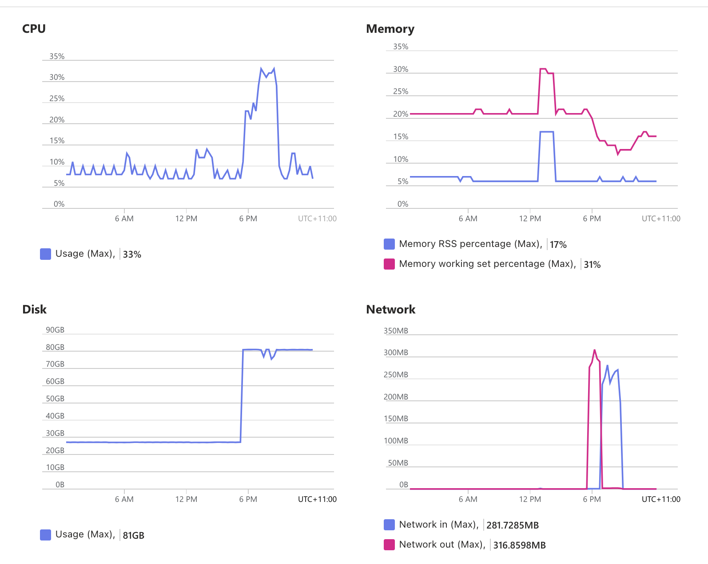

# Copy Speed Test for Azure File Storage

Pod Checkpointed data will be copied from local disk to azure file storage, at the same time, data on azure file storage also will be downloaded to local disk for restoring pod. so in this tutorial, the copy speed of azure file storage will be tested, and how long time will be taken for pod checkpoint/restore can be estimated based on the test result.

## 1. Test Environment

- AKS Node SKU: standard_d4_v3
- Azure File Storage SKU: Premium_LRS
- Region: East US

## 2. Test Solution

- copy a file with size=50GB from local disk to azure file storage 5 times, and calculate the average upload speed.
- copy a file with size=50GB from azure file storage to local disk 5 times, and calculate the average download speed.

## 3. Test Details

- AKS cluster is ready, and node has more than 50GB avaiable disk storage.
- Azure file storage plugin is installed and azurefile-premium StorageClass is prepared.

### 3.1 Create PVC

create a pvc with azurefile-premium StorageClass and request 100GB storage as following:

```
kubectl apply -f azure-file-pvc.yaml
```

### 3.2 Create Pod

the pod will be used for preparing local storage and azure storage space as following:
- local storage dir: /mnt/host-data
- azure file storage dir: /mnt/pvc-data

please execute the following command:

```
kubectl apply -f storage-test-pod.yaml
```

### 3.3 Prepare Test Data and Test Script

- copy test script into pod at first: `kubectl cp test-copy-speed.sh storage-test:/tmp/test-copy-speed.sh`
- exec into pod shell: `kubectl exec -ti storage-test -- /bin/bash`
- chmod of script file: `chmod +x /tmp/test-copy-speed.sh`
- execute the following command to generate a 50GB data file under /mnt/host-data dir:

```
dd if=/dev/zero of=/mnt/host-data/test50GB bs=1M count=51200
```

### 3.4 Execute Copy Test

now we are in the environment of storage-test pod:

- install bc tool before running `test-copy-speed.sh` script.
  
```
# install bc tool
apt-get update && apt-get install -y bc
```

- execute test copy script as following:

```
/tmp/test-copy-speed.sh
```

this script will test upload speed by default, and we can change src and dst to test download speed.

## 4. Test Result

- Average upload speed: **115.78 MB/s**
- Average download speed: **110.35 MB/s**

```
# upload test result details:

start copy test: from /mnt/host-data/test50GB to /mnt/pvc-data/test50GB_copy 5 times
-------------------------------
test number 1 ：
copy real duration：440.757783162 seconds
copy speed：116.16 MB/s
-------------------------------
test number 2 ：
copy real duration：417.530573271 seconds
copy speed：122.62 MB/s
-------------------------------
test number 3 ：
copy real duration：452.865274066 seconds
copy speed：113.05 MB/s
-------------------------------
test number 4 ：
copy real duration：453.446563636 seconds
copy speed：112.91 MB/s
-------------------------------
test number 5 ：
copy real duration：448.405223692 seconds
copy speed：114.18 MB/s
-------------------------------
average copy speed for 5 times：115.78 MB/s

### download test result details:

start copy test: from /mnt/pvc-data/test50GB to /mnt/host-data/test50GB_copy 5 times
-------------------------------
test number 1 ：
copy real duration：461.362056298 seconds
copy speed：110.97 MB/s
-------------------------------
test number 2 ：
copy real duration：451.353690121 seconds
copy speed：113.43 MB/s
-------------------------------
test number 3 ：
copy real duration：472.400910985 seconds
copy speed：108.38 MB/s
-------------------------------
test number 4 ：
copy real duration：477.894571493 seconds
copy speed：107.13 MB/s
-------------------------------
test number 5 ：
copy real duration：457.785046518 seconds
copy speed：111.84 MB/s
-------------------------------
average copy speed for 5 times：110.35 MB/s
```

## Others

The node resource utilization when executing copy tests.

