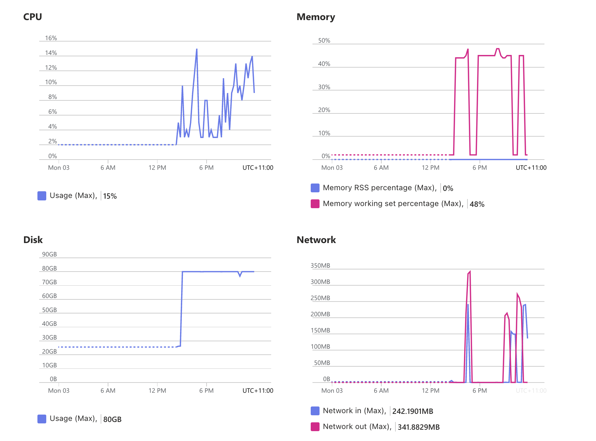

# Copy Speed Test for Azure File Storage

Pod Checkpointed data will be copied from local disk to azure storage, at the same time, data on azure storage also will be downloaded to local disk for restoring pod. so in this tutorial, the copy speed of azure storage will be tested, and how long time will be taken for pod checkpoint/restore can be estimated based on the test result.

## 1. Test Environment

- AKS Node SKU: Standard_NC6s_v3
- Azure Storage SKU: azure file storage/azure file share(provisoned v2)/azure disk storage
- Region: East US

## 2. Test Solution

- copy a file with size=50GB from local disk to azure storage 5 times, and calculate the average upload speed.
- copy a file with size=50GB from azure storage to local disk 5 times, and calculate the average download speed.

## 3. Test Details

- AKS cluster is ready, and node has more than 50GB available disk storage.
- Azure storage plugin is installed and azurefile-premium/azurefile-csi/managed-csi-premium StorageClasses are prepared.
- For azure file share(provisioned v2), end user should prepare related pv beforehand, the reference link is:
  https://learn.microsoft.com/en-us/azure/aks/azure-csi-files-storage-provision#create-an-azure-file-share


For each kind of azure storage, the following test steps should be executed once.

### 3.1 Create PVC

Take azure disk pvc(request 8Ti) as a example, create pvc as following:

```
kubectl apply -f azure-disk-pvc.yaml
```

`azure-file-pvc.yaml` for azure file storage, and `azure-file-share-pvc.yaml` for azure file share(provisioned v2). both of file storages only request 256Gi space.

### 3.2 Create Pod

the pod will be used for preparing local storage and azure storage space as following:
- local storage dir: /mnt/host-data
- azure file storage dir: /mnt/pvc-data

please execute the following command:

```
kubectl apply -f storage-test-pod.yaml
```

### 3.3 Prepare Test Data and Test Script

- copy test script into pod at first: `kubectl cp test-copy-speed.sh storage-test:/tmp/test-copy-speed.sh`
- exec into pod shell: `kubectl exec -ti storage-test -- /bin/bash`
- chmod of script file: `chmod +x /tmp/test-copy-speed.sh`
- install bc tool as following:
  
```
apt-get update && apt-get install -y bc
```

- execute the following command to generate a 50GB test data file under /mnt/host-data dir:

```
dd if=/dev/zero of=/mnt/host-data/test50GB bs=1M count=51200
```

### 3.4 Execute Copy Test

now we are in the environment of storage-test pod:

- execute test copy script as following:

```
/tmp/test-copy-speed.sh
```

this script will test upload speed by default, and we can change src and dst to test download speed.

## 4. Test Result

| storage  | upload speed(MB/s) | download speed(MB/s) |
|----------|----------|----------|
| azure disk | 341.20 | 288.27 |
| azure file | 149.02 | 126.06 |
| azure file share | 229.73 | 211.61 |

* size of azure disk: 8TB
* size of both of azure files: 256GB
* customized info of azure file share(provisioned v2) as following:
  - Throughout: 5120MB/s
  - IOPS: 50000: 

### test result details:

1. azure disk:
 
upload:
 
 ```
start copy test: from /mnt/host-data/test50GB to /mnt/pvc-data/test50GB_copy 5 times
-------------------------------
test number 1 ：
copy real duration：150.738304913 seconds
copy speed：339.66 MB/s
-------------------------------
test number 2 ：
copy real duration：149.883500907 seconds
copy speed：341.59 MB/s
-------------------------------
test number 3 ：
copy real duration：149.905550763 seconds
copy speed：341.54 MB/s
-------------------------------
test number 4 ：
copy real duration：149.901683022 seconds
copy speed：341.55 MB/s
-------------------------------
test number 5 ：
copy real duration：149.838200647 seconds
copy speed：341.70 MB/s
-------------------------------
average copy speed for 5 times：341.20 MB/s
```

download:

```
start copy test: from /mnt/pvc-data/test50GB to /mnt/host-data/test50GB_copy 5 times
-------------------------------
test number 1 ：
copy real duration：167.024950503 seconds
copy speed：306.54 MB/s
-------------------------------
test number 2 ：
copy real duration：166.335558750 seconds
copy speed：307.81 MB/s
-------------------------------
test number 3 ：
copy real duration：180.488444133 seconds
copy speed：283.67 MB/s
-------------------------------
test number 4 ：
copy real duration：185.996278594 seconds
copy speed：275.27 MB/s
-------------------------------
test number 5 ：
copy real duration：190.986550067 seconds
copy speed：268.08 MB/s
-------------------------------
average copy speed for 5 times：288.27 MB/s
```

2. azure file:
 
upload:
```
start copy test: from /mnt/host-data/test50GB to /mnt/pvc-data/test50GB_copy 5 times
-------------------------------
test number 1 ：
copy real duration：317.461659571 seconds
copy speed：161.27 MB/s
-------------------------------
test number 2 ：
copy real duration：307.261392755 seconds
copy speed：166.63 MB/s
-------------------------------
test number 3 ：
copy real duration：370.866704050 seconds
copy speed：138.05 MB/s
-------------------------------
test number 4 ：
copy real duration：351.610751648 seconds
copy speed：145.61 MB/s
-------------------------------
test number 5 ：
copy real duration：383.380944194 seconds
copy speed：133.54 MB/s
-------------------------------
average copy speed for 5 times：149.02 MB/s
```

download:
```
start copy test: from /mnt/pvc-data/test50GB to /mnt/host-data/test50GB_copy 5 times
-------------------------------
test number 1 ：
copy real duration：416.259820453 seconds
copy speed：123.00 MB/s
-------------------------------
test number 2 ：
copy real duration：411.432224751 seconds
copy speed：124.44 MB/s
-------------------------------
test number 3 ：
copy real duration：398.383864503 seconds
copy speed：128.51 MB/s
-------------------------------
test number 4 ：
copy real duration：404.274067517 seconds
copy speed：126.64 MB/s
-------------------------------
test number 5 ：
copy real duration：400.871424882 seconds
copy speed：127.72 MB/s
-------------------------------
average copy speed for 5 times：126.06 MB/s
```

3. azure file share:

upload:
```
start copy test: from /mnt/host-data/test50GB to /mnt/pvc-data/test50GB_copy 5 times
-------------------------------
test number 1 ：
copy real duration：202.025583403 seconds
copy speed：253.43 MB/s
-------------------------------
test number 2 ：
copy real duration：212.002521338 seconds
copy speed：241.50 MB/s
-------------------------------
test number 3 ：
copy real duration：248.077321368 seconds
copy speed：206.38 MB/s
-------------------------------
test number 4 ：
copy real duration：229.428569367 seconds
copy speed：223.16 MB/s
-------------------------------
test number 5 ：
copy real duration：228.360480924 seconds
copy speed：224.20 MB/s
-------------------------------
average copy speed for 5 times：229.73 MB/s
```

download:

```
start copy test: from /mnt/pvc-data/test50GB to /mnt/host-data/test50GB_copy 5 times
-------------------------------
test number 1 ：
copy real duration：238.880535215 seconds
copy speed：214.33 MB/s
-------------------------------
test number 2 ：
copy real duration：247.482785595 seconds
copy speed：206.88 MB/s
-------------------------------
test number 3 ：
copy real duration：246.899600868 seconds
copy speed：207.37 MB/s
-------------------------------
test number 4 ：
copy real duration：238.270283938 seconds
copy speed：214.88 MB/s
-------------------------------
test number 5 ：
copy real duration：238.545199522 seconds
copy speed：214.63 MB/s
-------------------------------
average copy speed for 5 times：211.61 MB/s
```

## Others

The node resource utilization when executing copy tests.

