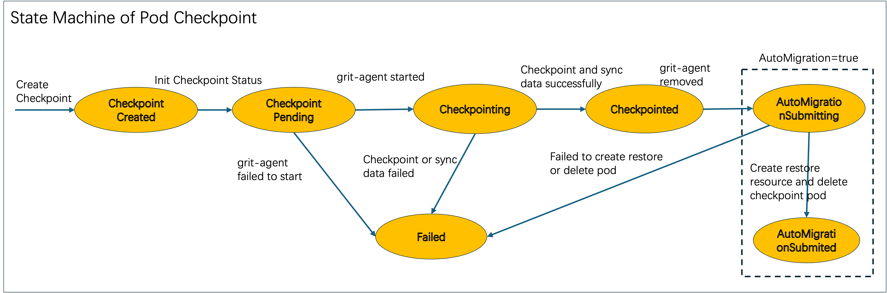
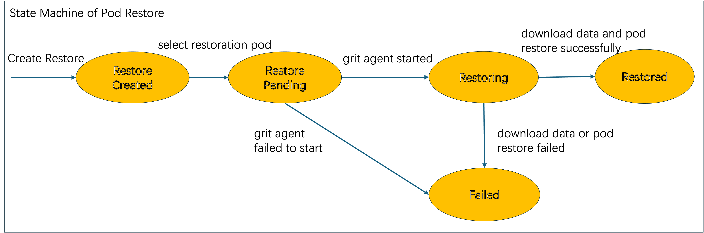

# CPU restoration and inter-node transfer

## Table of Contents

- [CPU restoration and inter-node transfer](#cpu-restoration-and-inter-node-transfer)
  - [Table of Contents](#table-of-contents)
  - [Glossary](#glossary)
  - [Summary](#summary)
  - [Motivation](#motivation)
    - [Goals](#goals)
    - [Non-Goals/Future Work](#non-goalsfuture-work)
  - [Proposal](#proposal)
    - [GRIT Architecture](#grit-architecture)
    - [State Machines](#state-machines)
      - [State Machine of Pod Checkpoint](#state-machine-of-pod-checkpoint)
      - [State Machine of Pod Restore](#state-machine-of-pod-restore)
    - [Checkpoint and Restore API](#checkpoint-and-restore-api)
    - [GRIT-Agent](#grit-agent)
    - [GRIT-Runtime](#grit-runtime)
  - [Implementation History](#implementation-history)

## Glossary

Refer to the [GRIT Glossary](./00_grit-glossary.md)

## Summary

As we known, Training a LLM(even fine-tuning a LLM) is a long-term work and cost a lot. If there is any problem cause training fail to complete, previous training works will be wasted and all of training should be started from the beginning.

Also there is a general requirement which migrating GPU workloads across nodes to consolidate workloads for increasing GPU resource usage efficiency or drain a node for system upgrading.

All of these scenairos, GPU workloads should be snapshotted and then restarted from the stop on new node. In this proposal, Based on CRIU tools and Kubernetes ecosystem, we propose a solution to checkpoint GPU workloads at any time without modifying and affecting them and restore workloads on different node from the checkpoint time. and end user complete all of works about GPU workloads checkout/restore just by creating a CRD resource(a Kubernetes native interactive way).

## Motivation

1. Kubernetes is a very mature container management system, and container is suitable for LLM management because of complicated denpendencies in LLM, so it is very common to adopt Kubernetes cluster to manage GPU resources and CPU workloads.
2. GPU workloads checkout/restore solution is increasingly attracting attention. and Kubernetes community has such kind of proposal, but limited to single container checkpoint/restore, and proguress is slow because of involveing too many changes to the Kubernetes. reference link is here: https://github.com/kubernetes/enhancements/issues/2008
3. It is convenient for end user to checkpoint/restore a specified pod by using a native Kubernetes way. at the same time, there is no need any modifications to pods, and specified pods don't aware of these actions.

### Goals

- Support checkpoint a GPU workload pod which runs on pytorch platform and restore the pod on a different node
- Checkpoint data of pod will be stored as a tar file in a distributed storage which can be shared across nodes efficiently.
- Checkpoint/Restore is an atomic operation of a pod, and can be completed in a Kubernetes native way(CRD resource).

### Non-Goals/Future Work

- Don't support checkpoint/restore multiple pods at the same specified timepoint.
- Checkpoint/Restore of bare pods and pods of Deployment and Job will be supported at first, other kinds of pod will be supported in the future.

## Proposal

### GRIT Architecture

End users can checkpoint/restore a specified pod through a CRIU cr resource, and pod will be checkpointed at first on the node(pod will be not affected).
and the checkpoint data will be stored on the specified location(like azure cloud storage). if pod restoration on other node is specified, the original pod
will be deleted, and new pod will be created and restored with checkpointed data. The detailed workflow is showed in the following feature:


GRIT components:
- GRIT-Manager: used as control-plane component for GRIT, including all controllers and webhooks for checkpointing and restoring, and run as Deployment Pod.
- GRIT-Agent: used for starting checkpointing on the node and sync data between local disk and cloud storage, and run as Job Pod. Because different kinds of cloud storage will be supported in the future version,so run as Daemonset can not be allowed.
- GRIT-runtime: as as shim between kubelet and containerd, and used for executing CRIU command, and run as systemd service.

Checkpoint and Restore action are defined by two independent CRDs, because end user maybe restore multiple times for one checkpoint.

**Checkpoint Workflow**

1. Create Checkpoint cr resource(phase: CheckpointPending):
  - Create request will be rejected for following conditions(GRIT-Manager):
    - the status of specified pod in Checkpoint cr is not running
    - the status of node where pod is running in Checkpoint cr is not running
    - the pvc/pvc(if specified) for storing checkpoint data is not ready
    - EnableMigratePod field is true when owner reference of pod is not Deployment and Job.
    - Checkpoint status will fall into failed if webhook validation failed.
  - Mutate Checkpoint cr resource(GRIT-Manager):
    - if the prefix of root dir for local disk in Checkpoint cr is not specified, the default value: /data/grit/pods will be set.
    - the hash value of pod spec will be stored in Checkpoint cr status.
    - Checkpoint status will be updated to CheckpointPending.
2. GRIT Agent Job Startup(phase: Checkpointing):
  - GRIT controller will distribute GRIT Agent job(include volume configurations for local disk and cloud storage) to the specified node when CR status becomes CheckpointPending.
  - GRIT Agent pod start to list/watch Checkpoint resource.
  - Checkpoint status will be updated to Checkpointing after GRIT Agent pod becomes running. but Checkpoint status will fall into failed if GRIT Agent failed to start.
3. Checkpoint Pod and Sync data to storage(phase: Checkpointed)
  - If the pod specified by Checkpoint resource is on the node, GRIT Agent calls GRIT runtime to checkpoint the pod and store the result into local disk.
  - data syncer in GRIT Agent pod will copy checkpointed data from local disk to cloud storage.
  - GRIT Agent will update Checkpoint status to Checkpointed and update Checkpoint.Status.CheckpointedDataPath when data syncer job completed successfully.
  
Moreover, If EnableMigratePod field is true in Checkpoint CR, GRIT controller will create corresponding Restore cr resource and delete pod specified by Checkpoint resource after checkpointing.

**Restore Workflow**

1. Create Restore cr resource(phase: RestorePending):
  - Create request will be rejected for following conditions(GRIT-Manager):
    - the status of related Checkpoint CR is not Checkpointed
    - the status of Restore CR will be updated to RestorePending, otherwise fall into failed status.
2. Select Pod and Startup GRIT Agent Job(phase: Restoring):
  - Select a new pod for restoration(GRIT-Manager):
    - For bare pod restoration, end user should apply a new bare pod with annotation linked to Restore cr.
    - For pods of Deployment or Job
      - the first created pod which matches the owner reference in Restore cr and hash value of pod spec is equal to hash value in related Checkpoint.Status will be selected as restoration pod. then an annotation linked to Restore cr resource will be added to this pod.
    - Update Restore.Status.RestorationPod for recording elected pod information in order to prevent selecting multiple pods for one Restore resource.
  - GRIT Agent Job Startup:
    - GRIT controller will distribute a GRIT Agent job to the specified node where restore pod is assigned.
    - GRIT Agent pod start to list/watch Restore resource.
  - Update Restore status to Restoring after GRIT Agent pod becomes running. but Restore status will fall into failed if GRIT Agent pod failed to start.
3. Sync data to local disk and restore Pod(phase: Restored):
  - data syncer in GRIT Agent job will download checkpointed data from cloud storage to local disk. if multiple GRIT Agent pods need to sync the same copy of checkpointed data, only one GRIT Agent pod will copy the data, others will skip data sync.
  - GRIT runtime will wait related checkpointed data ready when received pod with restoration annotation.
  - GRIT Agent will update Restore status to Restored when pod restoration completed successfully.

### State Machines

#### State Machine of Pod Checkpoint



- each state related detailed information will be recorded into Checkpoint.Status.Conditions field.
- each state will be updated to Checkpoint.Status.Phase field. 

#### State Machine of Pod Restore



- each state related detailed information will be recorded into Restore.Status.Conditions field.
- each state will be updated to Restore.Status.Phase field. 

### Checkpoint and Restore API

```go
type CheckpointPhase string

const (
  CheckpointPending CheckpointPhase = "Pending"
  Checkpointing     CheckpointPhase = "Checkpointing"
  Checkpointed      CheckpointPhase = "Checkpointed"
  CheckpointFailed  CheckpointPhase = "Failed"
)

type CheckpointSpec struct {
  // PodName is used to specify pod for checkpointing. only pod in the same namespace of Checkpoint will be selected.
  PodName string
  // Checkpoint result will be stored under this path on the node.
  // If no path is set, default value /data/grit/pods will be used.
  // Moreover, if no enough disk space under this path for storing checkpoint data, checkpoint will fail into failed state.
  LocalStoragePath string
  // RemoteStorage is used to specify cloud storage for storing checkpoint data and share data across nodes.
  // End user should ensure related pvc/pv resource exist and ready before creating Checkpoint resource.
  RemoteStorage *corev1.PersistentVolumeClaim
  // EnableMigratingPod is used for migrating pod across nodes. If true is set, related Restore resource will be created automatically, then checkpointed pod will be deleted by grit-manager, and a new pod will be created automatically by the pod owner(like Deployment and Job). this new pod will be selected as restoration pod and checkpointed data will be used for restoring new pod.
  // This field can be set to true for the following two cases:
  // 1. owner reference of pod is Deployment or Job.
  // 2. RemoteStorage field is specified as a cloud storage, this means checkpointed data can be shared across nodes.
  EnableMigratingPod bool
}

type CheckpointStatus struct {
  // PodHash is used for recording hash value of pod spec.
  // Checkpointed data can be used to restore for pod with same hash value.
  PodHash string
  // state machine of Checkpoint Phase: Pending --> Checkpointing --> Checkpointed or Failed.
  Phase CheckpointPhase
  // current state of pod checkpoint
  Conditions []metav1.Condition
  // checkpointed data is stored under this path. and the data in this path will be used for restoring pod.
  CheckpointedDataPath string
}

type Checkpoint struct {
  metav1.TypeMeta
  metav1.ObjectMeta
  Spec   CheckpointSpec
  Status CheckpointStatus
}

type RestorePhase string

const (
  RestorePending RestorePhase = "Pending"
  Restoring      RestorePhase = "Restoring"
  Restored       RestorePhase = "Restored"
  RestoreFailed  RestorePhase = "Failed"
)

type RestoreSpec struct {
  // CheckpointName is used to specify Checkpoint resource. only Checkpoint in the same namespace of Restore will be selected.
  // Only checkpointed Checkpoint will be accepted, and checkpointed data will be used for restoring pod.
  CheckpointName string
  // OwnerRef is used to specify owner reference of restoration pod.
  // Pod will be selected as restoration pod only when pod is created by owner and pod has the same hash value corresponding to Checkpoint.
  OwnerRef metav1.OwnerReference
  // The timeout of selecting pod for restoration.
  // if PodSelectionTimeoutSeconds is nil, Restore will never timeout and always wait for restoration pod created.
  PodSelectionTimeoutSeconds *int64
}

type RestoreStatus struct {
  // the pod specified by RestorationPod is selected for restoring.
  RestorationPod string
  // state machine of Restore Phase: Pending --> Restoring --> Restored or Failed.
  Phase RestorePhase
  // current state of pod restore
  Conditions []metav1.Condition
}

type Restore struct {
  metav1.TypeMeta
  metav1.ObjectMeta
  Spec   RestoreSpec
  Status RestoreStatus
}
```

### GRIT-Agent

### GRIT-Runtime

## Implementation History
- [ ] 02/24/2025: Open proposal PR

