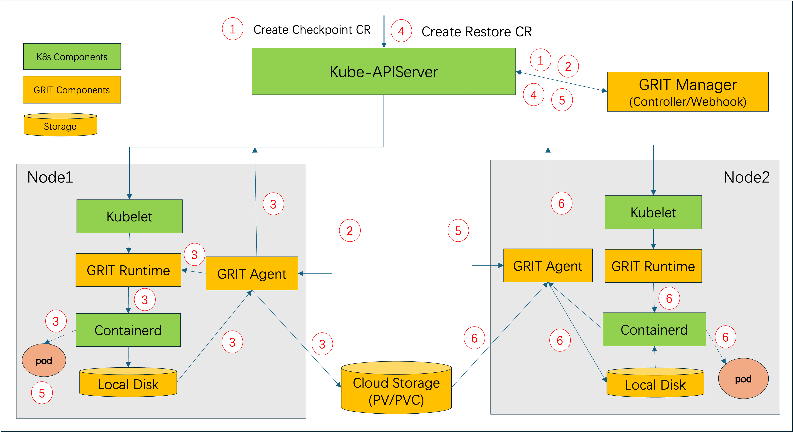
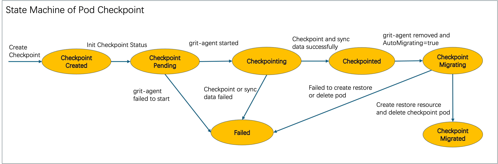
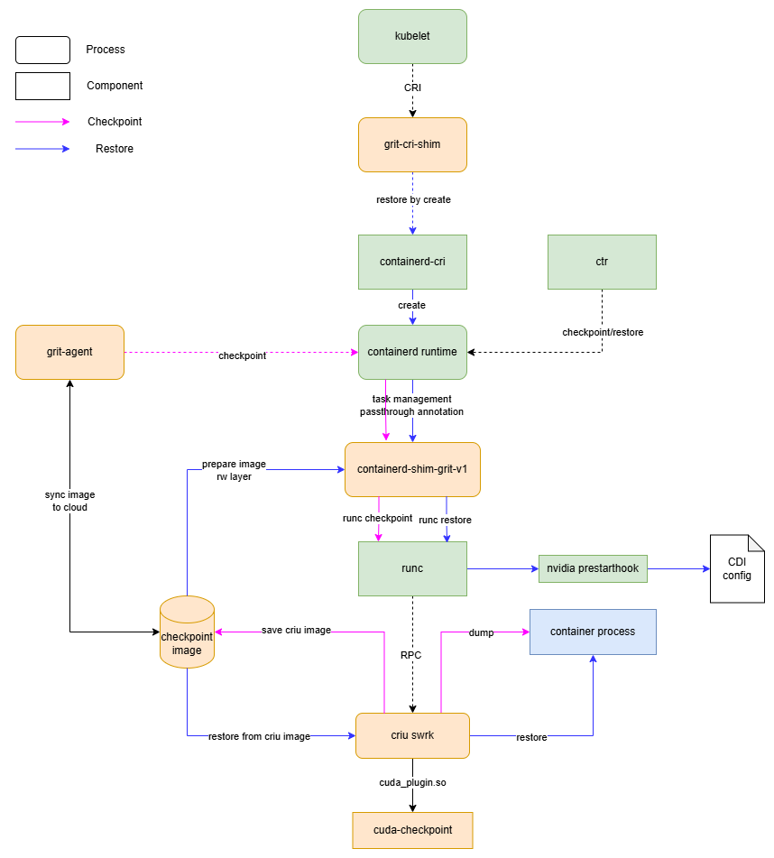

# GRIT: GPU workload checkpointing and restoration

## Table of Contents

- [GRIT: GPU workload checkpointing and restoration](#grit-gpu-workload-checkpointing-and-restoration)
  - [Table of Contents](#table-of-contents)
  - [Glossary](#glossary)
  - [Summary](#summary)
  - [Motivation](#motivation)
    - [Goals](#goals)
    - [Non-Goals/Future Work](#non-goalsfuture-work)
  - [Proposal](#proposal)
    - [GRIT Architecture](#grit-architecture)
    - [State Machines](#state-machines)
      - [State Machine of Pod Checkpoint](#state-machine-of-pod-checkpoint)
      - [State Machine of Pod Restore](#state-machine-of-pod-restore)
    - [Checkpoint and Restore API](#checkpoint-and-restore-api)
    - [GRIT-Agent](#grit-agent)
    - [GRIT-Runtime](#grit-runtime)
  - [Implementation History](#implementation-history)

## Glossary

Refer to the [GRIT Glossary](./00_grit-glossary.md)

## Summary

As we known, Training a LLM(even fine-tuning a LLM) is a long-term work and cost a lot. If there is any problem cause training fail to complete, previous training works will be wasted and all of training should be started from the beginning.

Also there is a general requirement which migrating GPU workloads across nodes to consolidate workloads for increasing GPU resource usage efficiency or drain a node for system upgrading.

All of these scenairos, GPU workloads should be snapshotted and then restarted from the stop on new node. In this proposal, Based on CRIU tools and Kubernetes ecosystem, we propose a solution to checkpoint GPU workloads at any time without modifying and affecting them and restore workloads on different node from the checkpoint time. and end user complete all of works about GPU workloads checkout/restore just by creating a CRD resource(a Kubernetes native interactive way).

## Motivation

1. Kubernetes is a very mature container management system, and container is suitable for LLM management because of complicated denpendencies in LLM, so it is very common to adopt Kubernetes cluster to manage GPU resources and CPU workloads.
2. GPU workloads checkout/restore solution is increasingly attracting attention. and Kubernetes community has such kind of proposal, but limited to single container checkpoint/restore, and proguress is slow because of involveing too many changes to the Kubernetes. reference link is here: https://github.com/kubernetes/enhancements/issues/2008
3. It is convenient for end user to checkpoint/restore a specified pod by using a native Kubernetes way. at the same time, there is no need any modifications to pods, and specified pods don't aware of these actions.

### Goals

- Support checkpointing a GPU workload pod which runs pytorch library and restoring the pod on a different node.
- Checkpoint data will be stored as a tar file in a shared storage (local nfs or cloud storage services) which can be accessed across nodes efficiently.
- Checkpoint/Restoration can be completed in a Kubernetes native approach (using CRD and operator).

### Non-Goals/Future Work

- Don't support checkpoint/restore multiple pods at the same specified timepoint.

## Proposal

### GRIT Architecture

Users can checkpoint/restore a specified pod through two CR resources, one Checkpoint CRD instance and one Restore CRD instance.
The checkpoint data will be stored on the specified location (like azure cloud storage). If the auto migration field is set in the checkpoint CR, the target pod
will be deleted, and a new pod will be created and restored using with checkpointed data. The detailed workflow is shown in the following feature:



GRIT components:
- GRIT-Manager: used as a control-plane component for GRIT, including all controllers and webhooks for checkpointing and restoration.
- GRIT-Agent: used in both checkpointing and restoration workflows. It runs as Job Pod created by the GRIT-manager.
- GRIT-runtime: it is a pluggable container runtime sitting between kubelet and containerd, receiving control plane signal from GRIT-Agent. it ultimately calls CRIU tools to checkpoint and restore the container process.

**Checkpoint Workflow**

1. Create Checkpoint CR resource:
    - CR Validation:
      - The status of the specified pod needs to be running.
      - The status of the node where the specified pod is running needs to be healthy.
      - The state of the pvc (if specified) for storing the checkpoint data needs to be ready.
    - Reconciler:
      - The hash value of the pod spec will be stored in Checkpoint cr status.
      - Checkpoint status will be updated to CheckpointPending.
2. Create Agent Job:
    - GRIT controller will create the GRIT Agent job (includes volume configurations specified in the checkpoint CR) to the node where the target Pod is running.
    - Checkpoint CR status will be updated to Checkpointing after GRIT Agent pod becomes running.
3. Checkpoint Pod and Sync data to storage:
    - GRIT Agent calls GRIT runtime to checkpoint the target pod and store the data into the volume configured in the agent pod.
    - GRIT Agent will update Checkpoint status to Checkpointed and update Checkpoint.Status.DataPath with the destination path when data copy completes (user does not need to specify the path, GRIT agent will specify one).
  
Moreover, if the `autoMigration` field is set in the Checkpoint CR, GRIT controller will create a corresponding Restore CR and delete the target pod after checkpointing is completed.

**Restore Workflow**

1. Create Restore cr resource (manually or automatically):
    - CR Validation:
      - The status of the linked Checkpoint CR needs to be Checkpointed.
    - Reconciler:
      - The status of Restore CR will be updated to RestorePending.
2. Select the target Pod:
    - Pod mutation webhook:
      - For every new Pod that matches the label selector in the Restore CR, check if the pod spec hash matches the one saved in the Checkpoint CR's status. If matches, adding a special **magic** annotation (e.g., the name of the restore CR) in pod annotation if the `targetPod` field in the Checkpoint CR's status is empty. Finally, update the Restore CR's status to Restoring and record the pod name in the `targetPod` field in the status.
      - The Restore.Status.TargetPod field is introduced to prevent selecting multiple pods for one Restore CR.
3. Create Agent Job:
    - GRIT controller will watch for the target Pod and create a GRIT Agent job to the Pod's running node after the pod is scheduled.
    - Update Restore CR status to Restoring after GRIT Agent pod becomes running.
4. Sync checkpoint data:
    - Data syncer in GRIT Agent job will download checkpoint data from the volume specified in the checkpoint CR to local disk immediately once the pod is running.
5. Restore the Pod:
    - GRIT runtime will block in `PullImage` call if the **magic** annotation is available in the Pod, waiting for the agent pod to download all checkpoint data, signaled by a sentinel file. 
    - GRIT containerd shim will intercept the `StartContainer` call to restore the container from the checkpoint data.
    - GRIT Agent job pod will update Restore status to Restored when pod restoration completed successfully.

### State Machines

#### State Machine of Pod Checkpoint



- each state related detailed information will be recorded into Checkpoint.Status.Conditions field.
- each state will be updated to Checkpoint.Status.Phase field. 

#### State Machine of Pod Restore


- each state related detailed information will be recorded into Restore.Status.Conditions field.
- each state will be updated to Restore.Status.Phase field. 

### Checkpoint and Restore API

```go
type CheckpointPhase string

const (
  CheckpointPending      CheckpointPhase = "Pending"
  Checkpointing          CheckpointPhase = "Checkpointing"
  Checkpointed           CheckpointPhase = "Checkpointed"
  CheckpointMigrating    CheckpointPhase = "Migrating"
  CheckpointMigrated     CheckpointPhase = "Migrated"
  CheckpointFailed       CheckpointPhase = "Failed"
)

type CheckpointSpec struct {
  // PodName is used to specify pod for checkpointing. only pod in the same namespace of Checkpoint will be selected.
  PodName string
  // Checkpoint result will be stored under this path on the node.
  // If no path is set, default value /data/grit/pods will be used.
  // Moreover, if no enough disk space under this path for storing checkpoint data, checkpoint will fail into failed state.
  HostPath *corev1.HostPathVolumeSource
  // VolumeClaim is used to specify cloud storage for storing checkpoint data and share data across nodes.
  // End user should ensure related pvc/pv resource exist and ready before creating Checkpoint resource.
  VolumeClaim *corev1.PersistentVolumeClaimVolumeSource
  // AutoMigration is used for migrating pod across nodes automatically. If true is set, related Restore resource will be created automatically, then checkpointed pod will be deleted by grit-manager, and a new pod will be created automatically by the pod owner(like Deployment and Job). this new pod will be selected as restoration pod and checkpointed data will be used for restoring new pod.
  // This field can be set to true for the following two cases:
  // 1. owner reference of pod is Deployment or Job.
  // 2. VolumeClaim field is specified as a cloud storage, this means checkpointed data can be shared across nodes.
  AutoMigration bool
}

type CheckpointStatus struct {
  // checkpointed pod is located on this node
  NodeName string
  // PodSpecHash is used for recording hash value of pod spec.
  // Checkpointed data can be used to restore for pod with same hash value.
  PodSpecHash string
  // state machine of Checkpoint Phase: Pending --> Checkpointing --> Checkpointed or Failed.
  Phase CheckpointPhase
  // current state of pod checkpoint
  Conditions []metav1.Condition
  // checkpointed data is stored under this path in the storage volume. and the data in this path will be used for restoring pod.
  DataPath string
}

type Checkpoint struct {
  metav1.TypeMeta
  metav1.ObjectMeta
  Spec   CheckpointSpec
  Status CheckpointStatus
}

type RestorePhase string

const (
  RestorePending RestorePhase = "Pending"
  Restoring      RestorePhase = "Restoring"
  Restored       RestorePhase = "Restored"
  RestoreFailed  RestorePhase = "Failed"
)

type RestoreSpec struct {
  // CheckpointName is used to specify Checkpoint resource. only Checkpoint in the same namespace of Restore will be selected.
  // Only checkpointed Checkpoint will be accepted, and checkpointed data will be used for restoring pod.
  CheckpointName string
  // Pod will be selected as target pod for restoring with following conditions:
  // 1. pod has labels which match this selector
  // 2. pod spec has the same hash value corresponding to Checkpoint.
  Selector *metav1.LabelSelector
}

type RestoreStatus struct {
  // the pod specified by TargetPod is selected for restoring.
  TargetPod string
  // state machine of Restore Phase: Pending --> Restoring --> Restored or Failed.
  Phase RestorePhase
  // current state of pod restore
  Conditions []metav1.Condition
}

type Restore struct {
  metav1.TypeMeta
  metav1.ObjectMeta
  Spec   RestoreSpec
  Status RestoreStatus
}
```

### GRIT-Agent

GRIT-Agent is responsible for packing checkpoint images and sync to cloud storage.

Each GRIT-Agent share the same host working directory, which is used to store checkpoint data temporarily. The GRIT-Agent will create a subdirectory under the working directory for each checkpoint operation. The subdirectory will be named after the checkpoint CR name.

```shell
/var/lib/grit-agent/
├── <checkpoint-cr-name-1>/
│   ├── checkpoint.tar.gz
│   └── download-state
├── <checkpoint-cr-name-2>/
```

### GRIT-Runtime

GRIT-Runtime is responsible for creating checkpoint images and restoring container processes using CRIU.



There are two parts in GRIT-Runtime:
- grit-cri-shim:
  - hijack CRI `PullImages` API. Block waiting for the agent pod to download all checkpoint data.
- containerd-shim-grit-v1: it is a binary plugin for containerd
  - hijack `containerd.task.v2.Task.Checkpoint` API. Call runc dump to build checkpoint image.
  - hijack `containerd.task.v2.Task.Create` API. If the **magic** annotation is available in the Pod, call runc store to start the container from the checkpoint image.

### Limitations

**From cuda-checkpoint**
- on the restore end it's required that the GPU type and order be the same as the checkpoint side.
- on the restore end it's required that the GPU driver version be the same as the checkpoint side.

**From criu**
- CDI is required when inject NVIDIA devices.

### Image management

There is an oci checkpoint image format defined by containerd. It packages both criu image tarball files and container image into a new oci image.
When the containerd recognizes this special format of oci image, it will unpack criu images from image layer and perform the restore operation.

GRIT proposes a solution to decouple the checkpoint image and container image. The checkpoint image will be distributed by an external storage. The container image will be pulled from the container registry as usual.

Advantages are as follows:
1. no need to rebuild a container image. In the era of LLM, both of container image and criu image are very large (> 15GB).
1. place the checkpoint image in a shared storage, which can be accessed by multiple nodes much faster than container registry.


**Checkpoint Image Format**

We manage this image in pods which contains images from different containers in this pod.

The first-level directory is named after the container name. The second-level directory contains criu image files, rootfs write layer and metadata files.
File naming was defined in https://github.com/checkpoint-restore/checkpointctl/blob/main/lib/metadata.go.
This image will be archived into a tarball file and stored in the shared storage.

```shell
<pod-image>/
├── <container-name-1>/
│   ├── checkpoint/
│   │   ├── pages-1.img
│   │   └── ...
│   ├── rootfs-diff.tar
│   ├── config.dump
│   └── spec.dump
└─── <container-name-2>/
    ├── checkpoint/
    │   ├── pages-1.img
    │   └── ...
    ├── rootfs-diff.tar
    ├── config.dump
    └── spec.dump
```

## Alternatives

### No grit containerd-shim

Containerd only supports to restore a container from an oci checkpoint image. It will prepare the rootfs by applying the rootfs-diff layer in engine side, then let containerd-shim to use this rootfs.
Without introducing a new containerd-shim, we need to make change to containerd engine.

## Implementation History
- [ ] 02/24/2025: Open proposal PR
